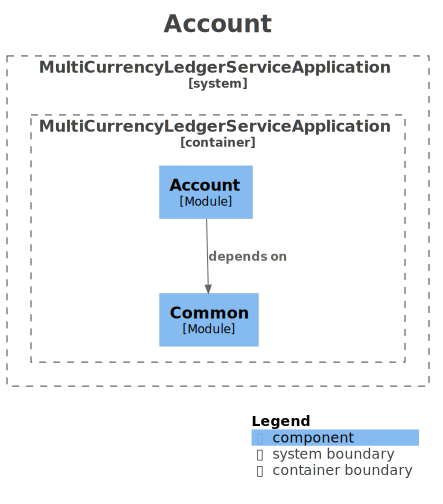
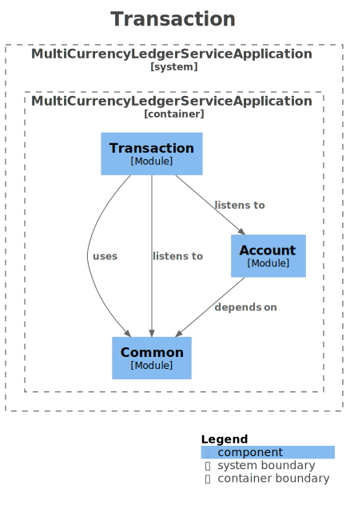

# 다중 자산 포트폴리오 불변 원장 시스템 <br> (Multi-Asset Ledger System)


본 프로젝트는 도메인 주도 설계(DDD)와 복식부기 모델을 기반으로 구축된 **엔터프라이즈급 불변 원장 코어 뱅킹 플랫폼**입니다.  
과거 메모리 기반의 단일 통화 원장 시스템을 발전시켜, 완벽한 대차평균의 정합성을 보장하면서도 현대 금융 환경에 맞춘 아키텍처를 적용하고 있습니다.

---

## 핵심 기반 아키텍처 (Core Architecture)

핵심 뱅킹 시스템이 갖추어야 할 철저한 기본기를 충실히 반영하여 설계되었습니다.

- **불변 객체 모델링 :** 금융 시스템의 부동소수점 오차 및 이종 통화 간 연산 오류를 원천적으로 방지하기 위해 정밀도 제어 로직을 반영한 `Money` VO(Value Object) 기반의 불변 설계를 적용했습니다.
- **견고한 동시성 제어 :** 데이터베이스 제약조건과 애플리케이션 레벨의 낙관적 락(Optimistic Lock, `@Version`)을 혼합하여 트랜잭션 동시성을 안전하게 제어하고 갱신 손실(Lost Update)을 방지합니다.
- **독립적 감사 로그 및 비동기 원장 동기화 :** 트랜잭셔널 아웃박스(Transactional Outbox) 패턴을 적용하여 비즈니스 거래 처리와 원장 기록의 생명주기를 물리적으로 분리하고 시스템 간 최종 정합성(Eventual Consistency)을 보장합니다.
- **기능 기반 패키징 :** 응집도를 높이고 도메인 간 결합도를 낮추기 위해 컨텍스트(Account, Transaction, Common) 단위의 기능 기반 패키지 구조를 채택했습니다.

---

## 시스템 진화 로드맵: 현재 달성 단계

본 플랫폼은 단순한 법정 화폐 입출금을 넘어 글로벌 금융 기관 수준의 다중 자산 포트폴리오를 취급하기 위해 고도화 로드맵을 밟고 있습니다.  
**현재 아키텍처는 아래의 제2단계 구축까지 완료한 상태입니다.**

### [Phase 1] 다중 자산 포트폴리오 모델링과 손익 산출 아키텍처

주식, 채권, 암호화폐, 외환 등 다양한 자산 클래스를 하나의 원장에서 수용할 수 있도록 원장 스키마와 손익 산출 파이프라인을 근본적으로 재설계하였습니다.

#### 1. 다중 자산 복식부기 스키마 설계 (Multi-Asset Double-Entry Schema)

이종 통화 간의 환율, 수량, 단가가 복합적으로 작용하는 환경에 대응하기 위해 전통적인 복식부기 모델을 확장했습니다.

- **가변적 정밀도 제어:** 암호화폐(최대 소수점 18자리) 등 다양한 자산의 특성에 맞게 고정 스케일이 아닌 가변적 정밀도 제어를 지원합니다.
- **풍부한 트랜잭션 컨텍스트:** 원장 테이블은 자산 코드 식별자뿐만 아니라, 거래 수량, 거래 당시 평가액을 나타내는 단가 및 환율 필드를 포함합니다.
- **이종 자산 간 복식부기 정합성:** 주식 매수 트랜잭션 발생 시, 현금 계좌에서는 대변으로 자금을 차감함과 동시에 주식 계좌에서는 차변으로 자산 수량이 증가하는 복식부기 분개를 생성합니다.

#### 2. 실현 손익 및 미실현 손익 수학적 모델링 (P&L Mathematical Modeling)

사용자 보유 자산의 정확한 가치 평가를 위해, 엄격한 금융 회계 기준에 따라 손익을 실현/미실현으로 분리하여 관리하고 있습니다.  
원장 시스템은 단순 잔액뿐만 아니라 개별 트랜잭션 단위의 이동 평균 단가를 병행 추적합니다.

| 손익 분류                            | 산출 시점 및 조건                            | 계산 로직                                  | 시스템 아키텍처 적용 방식                                                |
| :----------------------------------- | :------------------------------------------- | :----------------------------------------- | :----------------------------------------------------------------------- |
| **미실현 손익<br/>(Unrealized P&L)** | 실시간 또는 장 마감 시점의 시장 가격 반영    | `(현재 시장 가격 × 보유 수량) - 비용 기준` | 읽기 전용 뷰(Materialized View)에서 동적으로 계산하여 인메모리 캐싱 처리 |
| **실현 손익<br/>(Realized P&L)**     | 자산의 부분 또는 전량 매도 및 결제 발생 시점 | `(매도 가격 - 평균 매입 단가) × 매도 수량` | 매도 트랜잭션 발생 시 복식부기 원장에 명시적 분개로 영구 기록            |

---

### [Phase 2] 비동기 이벤트 기반 원장 동기화 및 코어 트레이딩 아키텍처

컨텍스트 간의 물리적 결합도를 낮추고 대규모 트래픽 환경하에서도 데이터 정합성을 보장하기 위해 분산 메시징 기초 인프라와 타입 안전성을 강화했습니다.

#### 1. Transactional Outbox 패턴 기반의 비동기 원장 동기화

- **이벤트 원자성 보장:** 계좌 도메인의 자산 변동 비즈니스 로직과 변동 이벤트(`TradeExecutedEvent`) 적재를 단일 로컬 트랜잭션으로 묶어 아웃박스 테이블에 영속화합니다.
- **최종 정합성 달성:** 주기적으로 작동하는 `OutboxRelayWorker`가 미처리 이벤트를 검출 및 폴링하여 원장 서비스(`LedgerService`)의 복식부기 분개 적재 로직을 트리거함으로써 시스템 간 정합성을 비동기적으로 완성합니다.

#### 2. 부패 방지 계층(ACL, Anti-Corruption Layer) 도입을 통한 도메인 격리

- 계좌 컨텍스트의 도메인 모델이나 상류 이벤트 포맷이 원장 도메인 내부까지 침투하여 전염시키지 않도록 중간에 `OrderToLedgerAcl` 매핑 계층을 배치했습니다.
- 수신된 도메인 이벤트를 분석하여 하류 원장 내부 규격에 최적화된 `LedgerRecordingCommand`로 명시적 번역을 수행합니다.

#### 3. Money VO 도입 및 수량·단가 검증식 고도화

- 가치 연산 시 부동소수점 오차율을 제로화하기 위해 모든 연산 단위를 `Money` 값 객체(Value Object) 체계로 전환하고 내부에서 자산 타입별 반올림 모드(`RoundingMode.HALF_EVEN`)를 강제합니다.
- `@PrePersist` 및 DB 내 `CHECK (amount = quantity * unit_price * exchange_rate)` 와 같은 이중 검증 구조를 통해 대차 불일치 및 가치 연산 미스매치 데이터를 원천 차단합니다.

---

## 📊 System Architecture (Living Documentation)

> 본 아키텍처 다이어그램은 코드가 변경됨에 따라 CI/CD 파이프라인에 의해 자동으로 최신화됩니다.

### 1. 시스템 전체 컴포넌트


### 2. Bounded Context

| Account (계좌 모듈)                                     | Transaction (원장 모듈)                                         |
| :------------------------------------------------------ | :-------------------------------------------------------------- |
|  |  |

---

## 프로젝트 구조 (Project Structure)

```text
multi-currency-ledger-service/
├── src/
│   ├── main/
│   │   ├── java/com/.../multi_currency_ledger_service/
│   │   │   ├── MultiCurrencyLedgerServiceApplication.java # 애플리케이션 진입점 (@EnableAsync, @EnableScheduling 추가)
│   │   │   │
│   │   │   ├── common/                                    # 공통 도메인 및 설정을 위한 인프라 (횡단 관심사)
│   │   │   │   ├── config/JpaAuditingConfig.java          # JPA Auditing 시간 정의 제공자 설정
│   │   │   │   ├── domain/Money.java                      # [핵심] 금액·수량 계산 및 자산타입 스케일 제어 VO
│   │   │   │   ├── domain/BaseEntity.java                 # 공통 생성일자 감사 엔티티
│   │   │   │   ├── exception/GlobalExceptionHandler.java  # 낙관적 락 충돌 및 도메인 규칙 전역 예외 처리기
│   │   │   │   ├── model/                                 # 공통 Enum (AssetType, EntryType)
│   │   │   │   └── outbox/                                # Transactional Outbox 엔티티, 저장소 및 워커
│   │   │   │
│   │   │   ├── account/                                   # [계좌 컨텍스트] 자산 잔고 및 코어 매매 비즈니스
│   │   │   │   ├── application/AccountTradeService.java   # 자산 매수/매도 트랜잭션 유스케이스 처리 서비스
│   │   │   │   ├── domain/Account.java                    # 계좌 마스터 도메인 엔티티
│   │   │   │   ├── domain/AccountBalance.java             # 계좌별 자산 수량 및 이동평균단가 관리 (낙관적 락 적용)
│   │   │   │   └── domain/event/TradeExecutedEvent.java   # 주문 체결 완료 알림 도메인 이벤트
│   │   │   │
│   │   │   └── transaction/                               # [원장 컨텍스트] 복식부기 원장 관리
│   │   │       ├── application/LedgerService.java         # 복식부기 자동 분개 처리 및 멱등성 보장 서비스
│   │   │       ├── domain/Transaction.java                # 트랜잭션 애그리거트 루트 (대차평균 정합성 사전 검증)
│   │   │       ├── domain/TransactionEntry.java           # 개별 차변/대변 분개 항목 엔티티 (Money VO 임베디드)
│   │   │       └── infrastructure/
│   │   │           ├── acl/OrderToLedgerAcl.java          # 상류 이벤트를 가로채 원장 커맨드로 번역하는 방어 계층
│   │   │           └── adapter/DummyExchangeRateAdapter.java # 외부 환율 시스템 연동 연동 인터페이스 구현체
│   │   │
│   │   └── resources/
│   │       ├── application.yaml                           # 다중 환경 인프라 및 로깅 프로파일 설정
│   │       └── db/migration/                              # Flyway 버전별 마이그레이션 스키마 관리
│   │           ├── V1__init_schema.sql                    # 초기 원장 테이블 및 인덱스 배치
│   │           ├── V1_1__add_unique_constraint.sql        # 계좌-자산 고유 복합 제약조건 추가
│   │           ├── V2__add_pnl_and_average_cost.sql       # 평균매입단가 및 실현손익 스키마 구조 확장
│   │           ├── V3__create_portfolio_view.sql          # 실시간 미실현 손익 조회를 위한 기본 뷰 생성
│   │           ├── V4__add_asset_types.sql                # 자산/금액별 명시적 통화 타입 스키마 마이그레이션
│   │           ├── V5__normalize_market_data.sql          # 다통화 지원 시장 데이터 구조 정규화 및 수식 체크 제약 추가
│   │           └── V6__create_outbox_events.sql           # 아웃박스 적재 테이블 및 조회용 부분 인덱스 신설
│   │
│   └── test/                                              # 테스트 레이어 (인프라 격리 및 도메인 검증)
│       └── java/com/.../
│           ├── IntegrationTestSupport.java                # Testcontainers 활용 Postgres/Redis 컨테이너 기동 지원 추상 클래스
│           ├── account/application/AccountTradeConcurrencyTest.java # 비동기 동시 매매 요청 시 낙관적 락 충돌 검증 테스트
│           ├── account/application/AccountTradeServiceTest.java     # 매매 비즈니스 흐름 및 이벤트 발행 연동 통합 테스트
│           ├── account/domain/AccountBalanceTest.java     # 물타기 시 평단가 재계산 및 매도 시 평단가 유지 단위 테스트
│           ├── common/outbox/OutboxRepositoryTest.java    # 아웃박스 이벤트 적재 및 영속화 레이어 테스트
│           ├── transaction/application/LedgerServiceTest.java     # 원장 복식부기 분개 기록 및 중복 요청 멱등성 테스트
│           └── transaction/infrastructure/acl/OrderToLedgerAclTest.java # ACL 레이어 이벤트 감지 및 커맨드 변환 테스트
```
