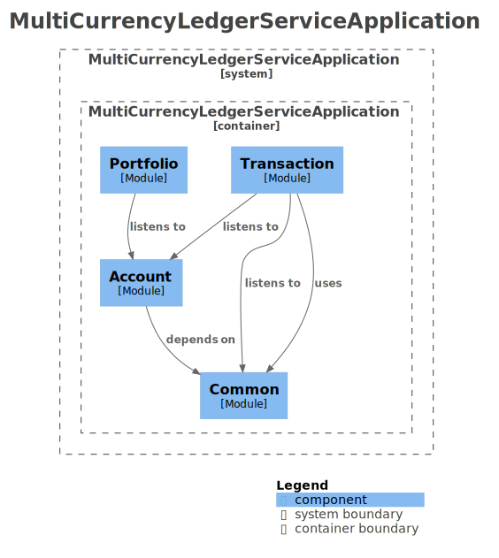

# 🏦 다중 자산 포트폴리오 불변 원장 시스템 <br>(Multi-Asset Ledger System)


> 도메인 주도 설계(DDD)와 복식부기 모델을 기반으로 구축된 **엔터프라이즈급 불변 원장 코어 뱅킹 플랫폼**입니다.
> 완벽한 대차평균 정합성을 보장하며, 글로벌 금융 환경에 대응하는 대규모 트래픽 및 다중 자산 처리 아키텍처를 지향합니다.

---

## ✨ 핵심 아키텍처 (Core Architecture)

금융 시스템의 생명인 **데이터 정합성**과 **성능**을 동시에 달성하기 위한 기반 설계입니다.

- 🛡️ **불변 객체 모델링:** `Money` VO(Value Object)를 도입하여 부동소수점 오차 및 이종 통화 간 연산 오류 원천 차단
- 🔒 **견고한 동시성 제어:** 낙관적 락(`@Version`)과 DB 유니크 제약조건을 결합하여 갱신 손실(Lost Update) 방지
- 🔄 **최종 정합성 (Eventual Consistency):** Transactional Outbox 패턴을 통한 비즈니스 로직과 원장 기록의 물리적 분리
- 📦 **기능 기반 패키징 (DDD):** Account, Transaction, Portfolio 등 컨텍스트 단위 분리로 도메인 간 결합도 최소화

---

## 🚀 시스템 진화 로드맵 & 주요 성과

단순 입출금을 넘어, 글로벌 수준의 다중 자산 포트폴리오 처리를 위해 **3단계 아키텍처 고도화**를 완료했습니다.

### [Phase 1] 다중 자산 수용 및 손익 파이프라인 구축

- **가변적 정밀도 제어:** 암호화폐(최대 소수점 18자리) 등 자산별 특성에 맞춘 동적 스케일 지원
- **이종 자산 복식부기:** 환율, 수량, 단가 변동을 원장 테이블에 포괄하여 자산 간 완벽한 교환 정합성 달성
- **손익 분리 모델링:**
  | 분류 | 산출 시점 | 시스템 처리 방식 |
  | :--- | :--- | :--- |
  | **미실현 손익** | 실시간 시장가 반영 | Materialized View 기반 동적 계산 및 인메모리 캐싱 |
  | **실현 손익** | 자산 매도/결제 시점 | 매도 트랜잭션 발생 시 복식부기 원장에 영구 기록 |

### [Phase 2] 비동기 이벤트 기반 원장 동기화

- **Transactional Outbox 패턴:** 계좌 변동 로직과 이벤트(`TradeExecutedEvent`) 발행을 단일 트랜잭션으로 묶어 이벤트 유실률 0% 달성
- **비동기 릴레이 Worker:** 주기적인 폴링 워커가 미처리 이벤트를 원장 서비스로 비동기 전달하여 최종 정합성 보장
- **부패 방지 계층 (ACL):** 상류 이벤트를 원장 내부 규격(`LedgerRecordingCommand`)으로 번역하여 도메인 오염 차단

### [Phase 3] CQRS 기반 읽기 최적화 및 월차 원장 도입

- **월차 원장 (Monthly Ledger) 패턴:** 무한 누적되는 스냅샷 역설을 해결하기 위해 월 단위 생명주기를 가진 원장 도입 (자동 이월/Rollover)
- **CQRS & 구체화된 뷰 (Materialized View):** \* 원장 기록(Write)과 자산 평가(Read) 책임을 물리적으로 분리
  - 트랜잭션 커밋 직후(`AFTER_COMMIT`) 백그라운드에서 View 비동기 갱신(`CONCURRENTLY`)
- **O(1) 실시간 포트폴리오 서빙:** 복잡한 조인 및 손익 계산 로직을 View로 이관하여, 클라이언트 조회 시 DTO 스냅샷만 즉시 반환

---

## 📊 System Architecture

> 코드가 변경됨에 따라 CI/CD 파이프라인에 의해 자동으로 최신화되는 Living Documentation입니다.

### 1. 시스템 컴포넌트



### 2. Bounded Context

| Account (계좌 모듈)                                              | Transaction (원장 모듈)                                                  | Portfolio (자산 모듈)                                                |
| :--------------------------------------------------------------- | :----------------------------------------------------------------------- | :------------------------------------------------------------------- |
|  |  |  |

---

## 📊 System Architecture & Topology

> 본 다이어그램은 CI/CD 파이프라인에 의해 실제 코드(Java Bytecode)로부터 자동 추출된 Living Documentation입니다.

### 1. 비즈니스 로직 토폴로지 (Service & Domain)

`AccountTradeService`, `LedgerService` 등 애플리케이션 서비스 계층이 내부 도메인 객체들을 어떻게 오케스트레이션 하는지 보여줍니다.


### 2. 패키지 의존성 및 컴포넌트 구조

도메인 간의 물리적 참조 방향을 나타내며, 순환 참조 여부를 시각적으로 확인할 수 있습니다.


---

## 📂 프로젝트 구조 (Project Structure)

<details>
<summary><b>핵심 디렉토리 구조 펼쳐보기</b></summary>

```text
multi-currency-ledger-service/
├── src/main/java/.../
│   ├── common/                               # [공통] Money VO, Outbox 워커, 전역 예외 처리
│   ├── account/                              # [Write] 월차 원장 기반 매매 트랜잭션 처리 (낙관적 락)
│   │   ├── application/AccountTradeService.java
│   │   └── domain/MonthlyAccountLedger.java
│   ├── portfolio/                            # [Read/CQRS] O(1) 포트폴리오 집계 및 비동기 뷰 갱신
│   │   ├── application/PortfolioQueryService.java
│   │   └── application/PortfolioViewRefresher.java
│   └── transaction/                          # [원장] 복식부기 분개, ACL (부패 방지 계층)
│       ├── application/LedgerService.java
│       └── infrastructure/acl/OrderToLedgerAcl.java
├── src/main/resources/db/migration/          # Flyway 마이그레이션 (월차 원장, Materialized View)
└── src/test/java/.../                        # Testcontainers 기반 롤오버/데드락 통합 테스트 스위트
```
