<div align="center">
  <h1>Multi-Asset Ledger System</h1>
  <p><b>엔터프라이즈급 다중 자산 포트폴리오 불변 원장 시스템</b></p>

  <p>
    
    
    
    
  </p>
</div>

> 도메인 주도 설계(DDD)와 복식부기(Double-entry) 모델을 기반으로 구축된 코어 뱅킹 플랫폼입니다.  
> 글로벌 금융 환경에 대응하는 대규모 트래픽 처리와 완벽한 대차평균 정합성을 보장합니다.

---

## Table of Contents
- [Core Architecture](#core-architecture)
- [Evolution Roadmap](#evolution-roadmap)
- [System Architecture](#system-architecture)
- [Project Structure](#project-structure)

---

## Core Architecture
금융 시스템의 핵심인 데이터 무결성(Integrity)과 성능(Performance)을 동시에 달성하기 위한 아키텍처 원칙입니다.

* **불변 객체 모델링 (Immutability)** 
  `Money` VO(Value Object)를 도입하여 부동소수점 오차 및 이종 통화 간 연산 오류를 원천 차단합니다.
* **견고한 동시성 제어 (Concurrency Control)** 
  낙관적 락(`@Version`)과 DB 유니크 제약조건, 그리고 비관적 락(`SKIP LOCKED`)을 결합하여 갱신 손실(Lost Update)을 완벽히 방지합니다.
* **최종 정합성 보장 (Eventual Consistency)** 
  Transactional Outbox 패턴과 Kafka 멱등성 프로듀서를 통해 비즈니스 로직과 원장 기록을 물리적으로 분리하고, 메시지 유실률 0%를 달성합니다.
* **기능 기반 패키징 (Spring Modulith)** 
  Account, Transaction, Portfolio, Reconciliation 등 컨텍스트 단위 분리로 도메인 간 결합도를 최소화합니다.
* **대용량 데이터 최적화 (High Throughput)** 
  월차 원장(Monthly Ledger) 기반의 CQRS 아키텍처, 인메모리 해시 대사 엔진, Hibernate Batch Insert를 통해 대규모 트랜잭션 성능을 최적화합니다.

---

## Evolution Roadmap
시스템 아키텍처는 총 7단계에 걸쳐 고도화되었으며, 분산 시스템의 안정성과 확장성을 중점으로 진화했습니다.

<details open>
<summary><b>[Phase 1~3] 도메인 모델링 및 성능 최적화</b></summary>
<br>

* **Phase 1: 다중 자산 수용 및 손익 파이프라인**
  * `Money` VO를 적용해 다양한 자산의 소수점 정밀도를 동적으로 처리
  * 미실현 손익과 실현 손익을 분리하여 복식부기에 기록
* **Phase 2: 비동기 이벤트 기반 원장 동기화**
  * Transactional Outbox 패턴을 도입하여 핵심 비즈니스 로직 병목 해소 및 시스템 응답성 향상
* **Phase 3: CQRS 및 월차 원장(Monthly Ledger) 도입**
  * 매월 스냅샷을 생성하는 월차 원장 개념 도입으로 대규모 원장 누적 시에도 O(1) 조회 성능 유지

</details>

<details open>
<summary><b>[Phase 4~7] 대규모 분산 아키텍처 및 안정성 고도화</b></summary>
<br>

* **Phase 4: 대규모 트랜잭션 자동 대사(Reconciliation)**
  * 외부 기관 정산 데이터와 내부 원장을 인메모리 해시 구조 및 다중 룰 엔진으로 고속 검증
  * 불일치 건 발생 시 DLQ(Dead Letter Queue)로 격리하여 무중단 배치 파이프라인 완성
* **Phase 5: Kafka 통합 및 최종 정합성 (Exactly-Once)**
  * 분산 환경에서 Kafka 멱등성 보장과 PostgreSQL `FOR UPDATE SKIP LOCKED` 큐 폴링을 결합해 메시지 중복/누락 원천 차단
  * Consumer의 `read_committed` 격리 수준 설정으로 더티 리드(Dirty Read) 현상을 완벽히 차단하는 트랜잭셔널 API 완성
* **Phase 6: 외부 연동 시스템 복원력 확보 (Resilience)**
  * Resilience4j 서킷 브레이커를 적용해 통제 범위 밖의 서드파티(PG사, 환율 API) 장애가 내부 시스템으로 전파(Cascading Failure)되는 것을 방지
  * 서드파티 완전 다운 시 빈 데이터를 반환하는 우아한 성능 저하(Graceful Degradation) 메커니즘 구축
* **Phase 7: 풀스택 관측성 파이프라인 (Observability)**
  * Correlation ID를 HTTP 진입점부터 Kafka 이벤트 컨슈머까지 주입하여 ELK 기반 분산 추적(Distributed Tracing) 체계 구축
  * Micrometer를 활용해 보유 현금 총액(Gauge), 폴백 횟수(Counter), 핵심 API 및 배치 응답 시간(Timer/Histogram) 등 비즈니스 커스텀 지표를 Prometheus로 실시간 노출

</details>

---

## System Architecture

<details>
<summary><b>모듈 및 컴포넌트 구성도</b></summary>

#### 1. System Components


#### 2. Bounded Context
| Account (계좌 모듈) | Transaction (원장 모듈) |
| :--- | :--- |
|  |  |
| **Portfolio (자산 모듈)** | **Reconciliation (대사 모듈)** |

```mermaid
classDiagram
  class MultiCurrencyLedgerServiceApplication {
    +void init()
    + void main(String[])
  }
  class AccountTradeService {
    +UUID buyAsset(UUID, String, AssetType, Money, Money)
    +UUID sellAsset(UUID, String, AssetType, Money, Money)
  }
  class MonthlyLedgerResolver {
    +MonthlyAccountLedger resolveOrInitializeLedger(UUID, String, AssetType, OffsetDateTime)
    +void initializeInNewTransaction(UUID, String, AssetType, String)
  }
  class Account {
    +boolean isNew()
    +UUID getId()
    +String getOwnerName()
    +String getStatus()
  }
  class MonthlyAccountLedger {
    + MonthlyAccountLedger carryForwardFrom(MonthlyAccountLedger, String)
    +void addBalance(Money, Money)
    +Money subtractBalance(Money)
    +Long getId()
    +UUID getAccountId()
    +String getAssetCode()
    +String getLedgerMonth()
    +Money getBalance()
    +Money getAverageUnitPrice()
    +boolean isCarriedForward()
    +Long getVersion()
  }
  class TradeExecutedEvent {
    +UUID tradeId()
    +UUID accountId()
    +String assetCode()
    +String assetType()
    +String fiatCode()
    +String tradeType()
    +BigDecimal quantity()
    +BigDecimal unitPrice()
    +BigDecimal exchangeRate()
    +BigDecimal averageCost()
    +boolean isStaleRate()
  }
  class AccountRepository {
    <<Interface>>
  }
  class MonthlyAccountLedgerRepository {
    <<Interface>>
    + Optional~MonthlyAccountLedger~ findByAccountIdAndAssetCodeAndLedgerMonth(UUID, String, String)
    + Optional~MonthlyAccountLedger~ findFirstByAccountIdAndAssetCodeOrderByLedgerMonthDesc(UUID, String)
  }
  class BaseEntity {
    <<Abstract>>
    +OffsetDateTime getCreatedAt()
  }
  class Money {
    + Money of(String, AssetType)
    + Money zero(AssetType)
    +Money add(Money)
    +Money subtract(Money)
    +Money multiply(BigDecimal)
    +Money divide(BigDecimal)
    +Money negate()
    +boolean isNegative()
    +boolean isZero()
    +int compareTo(Money)
    +BigDecimal getAmount()
    +AssetType getAssetType()
  }
  class DummyExchangeRateAdapter {
    +ExchangeRate getExchangeRate(String, String)
  }
  class LiveExchangeRateAdapter {
    +ExchangeRate getExchangeRate(String, String)
    +ExchangeRate fallbackExchangeRate(String, String, Throwable)
  }
  class AssetType {
    <<Enumeration>>
    FIAT
    STOCK
    CRYPTO
    +BigDecimal normalize(BigDecimal)
  }
  class TradeType {
    <<Enumeration>>
    BUY
    SELL
  }
  class KafkaProducerListener {
    +void handleOutboxMessageEvent(OutboxMessageEvent)
  }
  class EntryType {
    <<Enumeration>>
    DEBIT
    CREDIT
  }
  class SettlementStatus {
    <<Enumeration>>
    PENDING
    MATCHED
    UNMATCHED
    MANUALLY_RESOLVED
  }
  class OutboxEvent {
    +void markAsProcessed()
    +void recordFailure(String)
    +Long getId()
    +String getAggregateType()
    +String getAggregateId()
    +String getEventType()
    +String getPayload()
    +boolean isProcessed()
    +int getRetryCount()
    +String getErrorMessage()
    +boolean isDeadLetter()
  }
  class OutboxMessageEvent {
    +String eventType()
    +String payload()
  }
  class OutboxRelayWorker {
    +void relayOutboxEvents()
  }
  class OutboxRepository {
    <<Interface>>
    + List~OutboxEvent~ findUnprocessedEventsWithSkipLocked(int)
    + List~OutboxEvent~ findTop100ByProcessedFalseOrderByCreatedAtAsc()
  }
  class ExchangeRateProvider {
    <<Interface>>
    + ExchangeRate getExchangeRate(String, String)
  }
  class PortfolioQueryService {
    +PortfolioSummaryResponse getPortfolioSummary(UUID)
  }
  class PortfolioViewRefresher {
    +void handleTradeExecuted(TradeExecutedEvent)
  }
  class PortfolioSummaryResponse {
    +UUID accountId()
    +BigDecimal totalAssetValue()
    +BigDecimal totalUnrealizedPnl()
    +boolean isStaleData()
    +List~AssetDetailDto~ assets()
  }
  class CurrentPortfolio {
    +String getId()
    +UUID getAccountId()
    +String getAssetCode()
    +BigDecimal getTotalQuantity()
    +BigDecimal getAvgUnitPrice()
    +BigDecimal getCurrentMarketPrice()
    +BigDecimal getUnrealizedPnl()
    +String getLastUpdatedMonth()
  }
  class PortfolioQueryRepository {
    <<Interface>>
    + List~CurrentPortfolio~ findAllByAccountId(UUID)
  }
  class PortfolioController {
    +ResponseEntity~PortfolioSummaryResponse~ getPortfolioSummary(UUID)
  }
  class ReconciliationDeadLetterRepository {
    <<Interface>>
    + Page~ReconciliationDeadLetter~ findUnresolvedDeadLetters(Pageable)
  }
  class HeuristicMatchingProcessor {
    +MatchedReconciliationResult process(ExternalSettlement)
  }
  class MatchedReconciliationResult {
    +ExternalSettlement externalSettlement()
    +UUID matchedTransactionId()
    +Money feeDifference()
  }
  class ReconciliationResultWriter {
    +void write(Chunk~? extends MatchedReconciliationResult~)
  }
  class MatchingRule {
    <<Interface>>
    + RuleResult evaluate(ExternalSettlement, InternalTransactionCandidate)
    + int getOrder()
  }
  class RuleResult {
    + RuleResultBuilder builder()
    +boolean isPassed()
    +int getScore()
    +String getFailReason()
  }
  class ManualReconciliationService {
    +void resolveManually(Long, UUID, Money)
  }
  class ExternalSettlement {
    + ExternalSettlement create(String, String, OffsetDateTime, String, Money)
    + ExternalSettlement create(String, String, OffsetDateTime, String, Money, String)
    +void markAsMatched(UUID)
    +void markAsUnmatched()
    +void resolveManually(UUID)
    +boolean isNew()
    +UUID getId()
    +OffsetDateTime getSettlementDate()
    +String getExternalReferenceId()
    +String getInstitutionCode()
    +String getDescription()
    +Money getAmount()
    +String getCurrencyCode()
    +SettlementStatus getStatus()
    +UUID getMatchedInternalTransactionId()
  }
  class ReconciliationDeadLetter {
    + ReconciliationDeadLetter isolate(UUID, FailureReason, String, String)
    +void markAsResolved()
  }
  class ReconciliationFeeAdjustedEvent {
    +UUID settlementId()
    +Money feeDifference()
  }
  class ExternalSettlementRepository {
    <<Interface>>
    + Optional~ExternalSettlement~ findByIdWithoutPartitionKey(UUID)
    + Optional~ExternalSettlement~ findByInstitutionCodeAndExternalReferenceId(String, String)
  }
  class ExternalSettlementDto {
    +String transactionId()
    +String currency()
    +BigDecimal amount()
    +BigDecimal fee()
    +String status()
    +OffsetDateTime settledAt()
  }
  class PgSettlementAdapter {
    +ExternalSettlementDto fetchSettlement(String)
  }
  class LedgerService {
    +void recordDoubleEntry(LedgerRecordingCommand)
  }
  class LedgerRecordingCommand {
    +UUID referenceTradeId()
    +UUID accountId()
    +String assetCode()
    +String fiatCode()
    +String tradeType()
    +Money quantity()
    +Money unitPrice()
    +BigDecimal exchangeRate()
    +Money averageCost()
    +boolean isStaleRate()
  }
  class Transaction {
    +void addBuyEntry(UUID, String, Money, Money, BigDecimal)
    +void addSellEntry(UUID, String, Money, Money, BigDecimal, Money)
    +boolean isNew()
    +UUID getId()
    +String getTransactionType()
    +String getDescription()
    +OffsetDateTime getTransactedAt()
    +List~TransactionEntry~ getEntries()
  }
  class TransactionEntry {
    + TransactionEntry createBuyEntry(Transaction, UUID, String, Money, Money, BigDecimal)
    + TransactionEntry createSellEntry(Transaction, UUID, String, Money, Money, BigDecimal, Money)
    +Long getId()
    +Transaction getTransaction()
    +UUID getAccountId()
    +EntryType getEntryType()
    +String getAssetCode()
    +Money getQuantity()
    +Money getUnitPrice()
    +Money getAmount()
    +Money getRealizedPnl()
    +BigDecimal getExchangeRate()
  }
  class TransactionRepository {
    <<Interface>>
    + Optional~Transaction~ findWithEntriesById(UUID)
  }
  class OrderToLedgerAcl {
    +void persistOutboxEvent(TradeExecutedEvent)
    +void handleOutboxRelay(OutboxMessageEvent)
  }
  class ReconciliationToLedgerAcl {
    +void handle(ReconciliationFeeAdjustedEvent)
  }
  AccountTradeService --> MonthlyLedgerResolver
  AccountTradeService --> ExchangeRateProvider
  MonthlyLedgerResolver --> MonthlyAccountLedgerRepository
  Account --|> BaseEntity
  MonthlyAccountLedger --|> BaseEntity
  MonthlyAccountLedger --> Money
  Money --> AssetType
  DummyExchangeRateAdapter ..|> ExchangeRateProvider
  LiveExchangeRateAdapter ..|> ExchangeRateProvider
  OutboxEvent --|> BaseEntity
  OutboxRelayWorker --> OutboxRepository
  PortfolioQueryService --> PortfolioQueryRepository
  PortfolioQueryService --> ExchangeRateProvider
  PortfolioController --> PortfolioQueryService
  HeuristicMatchingProcessor --> MatchingRule
  MatchedReconciliationResult --> ExternalSettlement
  MatchedReconciliationResult --> Money
  ReconciliationResultWriter --> ExternalSettlementRepository
  ManualReconciliationService --> ExternalSettlementRepository
  ManualReconciliationService --> ReconciliationDeadLetterRepository
  ExternalSettlement --|> BaseEntity
  ExternalSettlement --> SettlementStatus
  ExternalSettlement --> Money
  ReconciliationDeadLetter --|> BaseEntity
  ReconciliationFeeAdjustedEvent --> Money
  LedgerService --> TransactionRepository
  LedgerRecordingCommand --> Money
  Transaction "0..1" o-- "0..*" TransactionEntry
  TransactionEntry --> EntryType
  TransactionEntry --> Money
  OrderToLedgerAcl --> LedgerService
  OrderToLedgerAcl --> OutboxRepository
  ReconciliationToLedgerAcl --> LedgerService
```

|  |  |

</details>

<details>
<summary><b>전체 클래스 다이어그램</b></summary>


</details>

---

## Project Structure

<details>
<summary><b>핵심 디렉토리 구조</b></summary>

```text
multi-currency-ledger-service/
├── src/main/java/.../
│   ├── common/                               # [공통] Money VO, 전역 예외 처리, 인프라 Config
│   ├── account/                              # [Write] 월차 원장 기반 매매 트랜잭션 (낙관적 락)
│   ├── portfolio/                            # [Read/CQRS] O(1) 포트폴리오 집계 및 비동기 뷰 갱신
│   ├── transaction/                          # [원장] 복식부기 분개, ACL (부패 방지 계층)
│   └── reconciliation/                       # [대사/Batch] 해시 매칭 엔진 및 DLQ 처리
├── src/main/resources/db/migration/          # Flyway 마이그레이션 (파티셔닝 스키마, DLQ 등)
└── src/test/java/.../                        # E2E 통합 테스트, Testcontainers 기반 격리 테스트
```

</details>
