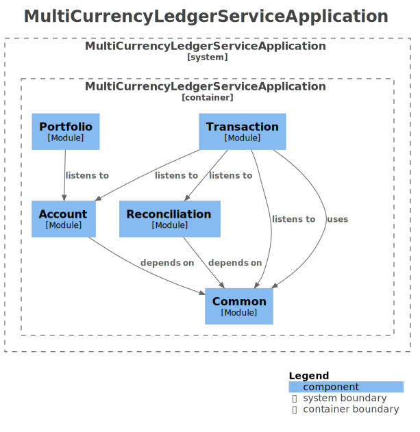
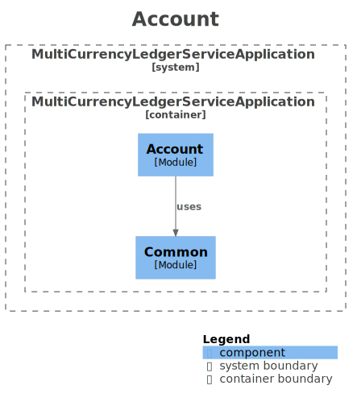
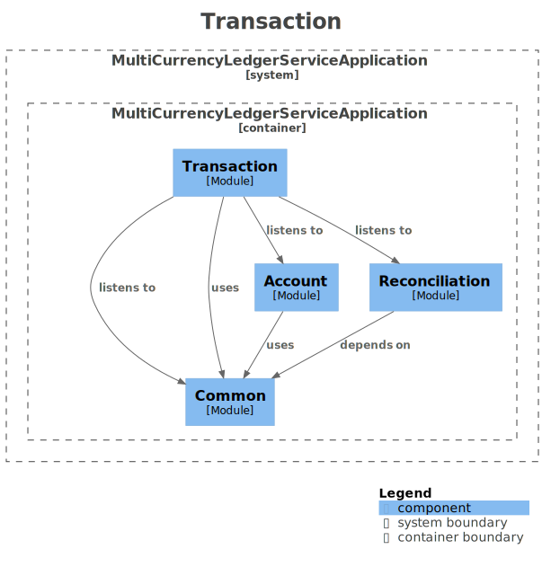
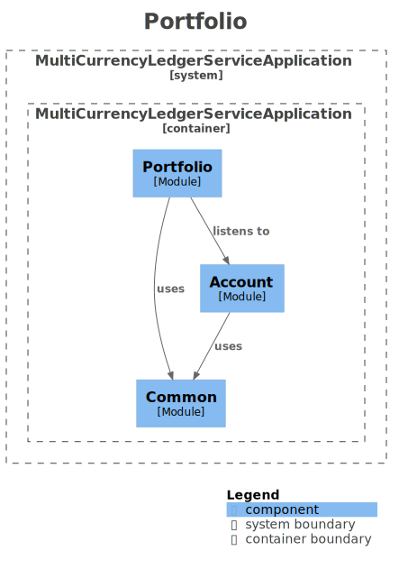
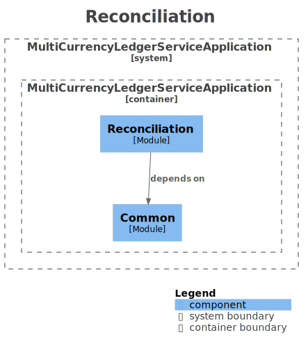

# 🏦 다중 자산 포트폴리오 불변 원장 시스템 <br>(Multi-Asset Ledger System)


> 도메인 주도 설계(DDD)와 복식부기 모델을 기반으로 구축된 **엔터프라이즈급 불변 원장 코어 뱅킹 플랫폼**입니다.  
> 완벽한 대차평균 정합성을 보장하며, 글로벌 금융 환경에 대응하는 대규모 트래픽 및 다중 자산 처리 아키텍처를 지향합니다.

---

## ✨ 핵심 아키텍처 (Core Architecture)

금융 시스템의 생명인 **데이터 정합성**과 **성능**을 동시에 달성하기 위한 기반 설계입니다.

- 🛡️ **불변 객체 모델링:** `Money` VO(Value Object)를 도입하여 부동소수점 오차 및 이종 통화 간 연산 오류 원천 차단
- 🔒 **견고한 동시성 제어:** 낙관적 락(`@Version`)과 DB 유니크 제약조건을 결합하여 갱신 손실(Lost Update) 방지
- 🔄 **최종 정합성 (Eventual Consistency):** Transactional Outbox 패턴을 통한 비즈니스 로직과 원장 기록의 물리적 분리
- 📦 **기능 기반 패키징 (DDD):** Account, Transaction, Portfolio, Reconciliation 등 컨텍스트 단위 분리로 도메인 간 결합도 최소화

---

## 🚀 시스템 진화 로드맵 & 주요 성과

> **5단계 아키텍처 고도화**를 완료했습니다.

### [Phase 1] 다중 자산 수용 및 손익 파이프라인

- **진화 목표:** 원화 입출금을 넘어 주식, 암호화폐 등 **다양한 자산을 한 곳에서 오차 없이 관리**하는 기반 다지기
- **주요 성과:**
- 자산별로 다른 소수점 정밀도를 동적으로 처리하고, 부동소수점 오차를 막기 위해 불변 객체(`Money` VO) 적용
- 실시간 시장가에 따른 '미실현 손익'과 매도 시점의 '실현 손익'을 완벽하게 분리하여 복식부기 원장에 기록

### [Phase 2] 비동기 이벤트 기반 원장 동기화

- **진화 목표:** 거래량이 폭증해도 사용자의 주문 요청이 지연되지 않도록 **시스템의 병목 구간 해소**
- **주요 성과:**
- 계좌 변동 로직과 원장 기록 로직을 분리하여 핵심 비즈니스 로직의 응답 속도 향상
- 데이터베이스 트랜잭션과 메시지 발행을 하나로 묶는 **Transactional Outbox 패턴**을 도입해 이벤트 유실률 0% 달성

### [Phase 3] CQRS 및 월차 원장(Monthly Ledger) 도입

- **진화 목표:** 수백만 건의 원장 데이터가 누적되어도 **포트폴리오 조회 속도를 O(1) 수준으로 유지**
- **주요 성과:**
- 데이터 '쓰기'와 '읽기' 책임을 물리적으로 분리하는 **CQRS 아키텍처** 적용 (구체화된 뷰 비동기 갱신)
- 무한히 데이터가 쌓여 연산이 느려지는 것을 방지하기 위해, 매월 스냅샷을 뜨는 **'월차 원장'** 개념을 도입하여 조회 성능 한계 극복

### [Phase 4] 대규모 트랜잭션 자동 대사(Reconciliation) 엔진

- **진화 목표:** 외부 기관(PG사, 거래소 등)의 정산 데이터와 우리 시스템의 **원장이 1원이라도 틀리지 않도록 자동 검증**
- **주요 성과:**
- 무거운 DB JOIN 대신 **인메모리 해시 매칭**과 다중 룰 엔진(시간/금액 오차 허용)을 적용해 대규모 배치(Spring Batch) 처리 속도 극대화
- 불일치 데이터 발생 시 전체 작업을 멈추지 않고 DLQ(Dead Letter Queue)로 안전하게 격리하여 무중단 배치 파이프라인 완성

### [Phase 5] Kafka 통합 및 완벽한 최종 정합성(EOS)

- **진화 목표:** 서버가 여러 대로 확장(Scale-out)되고 네트워크 장애가 발생해도 **데이터 중복이나 누락을 원천 차단**
- **주요 성과:**
- 여러 워커(Worker)가 동시에 데이터를 퍼가도 충돌하지 않도록 PostgreSQL의 비관적 락(`FOR UPDATE SKIP LOCKED`)을 적용하여 동시성 최적화
- Kafka의 멱등성 프로듀서를 활용해 분산 환경에서도 메시지가 **'정확히 한 번 처리(Exactly-Once)'** 되도록 보장하는 엔터프라이즈 인프라 완성

---

## 📊 System Architecture

> 본 다이어그램은 CI/CD 파이프라인에 의해 코드로부터 자동 추출된 Living Documentation입니다.

### 1. 시스템 컴포넌트



### 2. Bounded Context

| Account (계좌 모듈)                                              | Transaction (원장 모듈)                                                  |
| :--------------------------------------------------------------- | :----------------------------------------------------------------------- |
|  |  |

| Portfolio (자산 모듈)                                                | Reconciliation (대사 모듈)                                                     |
| :------------------------------------------------------------------- | :----------------------------------------------------------------------------- |
|  |  |

### 3. Class Diagram

```mermaid
classDiagram
  class MultiCurrencyLedgerServiceApplication {
    +void init()
    + void main(String[])
  }
  class AccountTradeService {
    +UUID buyAsset(UUID, String, AssetType, Money, Money)
    +UUID sellAsset(UUID, String, AssetType, Money, Money)
  }
  class MonthlyLedgerResolver {
    +MonthlyAccountLedger resolveOrInitializeLedger(UUID, String, AssetType, OffsetDateTime)
    +void initializeInNewTransaction(UUID, String, AssetType, String)
  }
  class Account {
    +UUID getId()
    +String getOwnerName()
    +String getStatus()
  }
  class MonthlyAccountLedger {
    + MonthlyAccountLedger carryForwardFrom(MonthlyAccountLedger, String)
    +void addBalance(Money, Money)
    +Money subtractBalance(Money)
    +Long getId()
    +UUID getAccountId()
    +String getAssetCode()
    +String getLedgerMonth()
    +Money getBalance()
    +Money getAverageUnitPrice()
    +boolean isCarriedForward()
    +Long getVersion()
  }
  class TradeExecutedEvent {
    +UUID tradeId()
    +UUID accountId()
    +String assetCode()
    +String assetType()
    +String fiatCode()
    +String tradeType()
    +BigDecimal quantity()
    +BigDecimal unitPrice()
    +BigDecimal exchangeRate()
    +BigDecimal averageCost()
  }
  class AccountRepository {
    <<Interface>>
  }
  class MonthlyAccountLedgerRepository {
    <<Interface>>
    + Optional~MonthlyAccountLedger~ findByAccountIdAndAssetCodeAndLedgerMonth(UUID, String, String)
    + Optional~MonthlyAccountLedger~ findFirstByAccountIdAndAssetCodeOrderByLedgerMonthDesc(UUID, String)
  }
  class JpaConfig {
    +DateTimeProvider offsetDateTimeProvider()
  }
  class KafkaProducerConfig {
    +ProducerFactory~String, String~ primaryProducerFactory()
    +KafkaTemplate~String, String~ primaryKafkaTemplate()
  }
  class BaseEntity {
    <<Abstract>>
    +OffsetDateTime getCreatedAt()
  }
  class Money {
    + Money of(String, AssetType)
    + Money zero(AssetType)
    +Money add(Money)
    +Money subtract(Money)
    +Money multiply(BigDecimal)
    +Money divide(BigDecimal)
    +Money negate()
    +boolean isNegative()
    +boolean isZero()
    +int compareTo(Money)
    +BigDecimal getAmount()
    +AssetType getAssetType()
  }
  class ErrorResponse {
    +String code()
    +String message()
  }
  class GlobalExceptionHandler {
    +ResponseEntity~ErrorResponse~ handleIllegalArgument(IllegalArgumentException)
    +ResponseEntity~ErrorResponse~ handleOptimisticLockingFailure(OptimisticLockingFailureException)
    +ResponseEntity~ErrorResponse~ handleIllegalState(IllegalStateException)
  }
  class AssetType {
    <<Enumeration>>
    FIAT
    STOCK
    CRYPTO
    +BigDecimal normalize(BigDecimal)
  }
  class EntryType {
    <<Enumeration>>
    DEBIT
    CREDIT
  }
  class FailureReason {
    <<Enumeration>>
    AMOUNT_MISMATCH
    TEXT_NOT_FOUND
    TIME_WINDOW_EXCEEDED
    SYSTEM_ERROR
  }
  class SettlementStatus {
    <<Enumeration>>
    PENDING
    MATCHED
    UNMATCHED
    MANUALLY_RESOLVED
  }
  class KafkaProducerListener {
    +void handleOutboxMessageEvent(OutboxMessageEvent)
  }
  class OutboxEvent {
    +void markAsProcessed()
    +void recordFailure(String)
    +Long getId()
    +String getAggregateType()
    +String getAggregateId()
    +String getEventType()
    +String getPayload()
    +LocalDateTime getCreatedAt()
    +boolean isProcessed()
    +int getRetryCount()
    +String getErrorMessage()
    +boolean isDeadLetter()
  }
  class OutboxMessageEvent {
    +String eventType()
    +String payload()
  }
  class OutboxRelayWorker {
    +void relayOutboxEvents()
  }
  class OutboxRepository {
    <<Interface>>
    + List~OutboxEvent~ findUnprocessedEventsWithSkipLocked(int)
    + List~OutboxEvent~ findTop100ByProcessedFalseOrderByCreatedAtAsc()
  }
  class PortfolioQueryService {
    +PortfolioSummaryResponse getPortfolioSummary(UUID)
  }
  class PortfolioViewRefresher {
    +void handleTradeExecuted(TradeExecutedEvent)
  }
  class PortfolioSummaryResponse {
    +UUID accountId()
    +BigDecimal totalAssetValue()
    +BigDecimal totalUnrealizedPnl()
    +List~AssetDetailDto~ assets()
  }
  class PortfolioSummaryResponse_AssetDetailDto {
    +String assetCode()
    +BigDecimal quantity()
    +BigDecimal avgUnitPrice()
    +BigDecimal currentMarketPrice()
    +BigDecimal totalValue()
    +BigDecimal unrealizedPnl()
  }
  class CurrentPortfolio {
    +String getId()
    +UUID getAccountId()
    +String getAssetCode()
    +BigDecimal getTotalQuantity()
    +BigDecimal getAvgUnitPrice()
    +BigDecimal getCurrentMarketPrice()
    +BigDecimal getUnrealizedPnl()
    +String getLastUpdatedMonth()
  }
  class PortfolioQueryRepository {
    <<Interface>>
    + List~CurrentPortfolio~ findAllByAccountId(UUID)
  }
  class PortfolioController {
    +ResponseEntity~PortfolioSummaryResponse~ getPortfolioSummary(UUID)
  }
  class ReconciliationDeadLetterRepository {
    <<Interface>>
    + Page~ReconciliationDeadLetter~ findUnresolvedDeadLetters(Pageable)
  }
  class HeuristicMatchingProcessor {
    +MatchedReconciliationResult process(ExternalSettlement)
  }
  class MatchedReconciliationResult {
    +ExternalSettlement externalSettlement()
    +UUID matchedTransactionId()
    +Money feeDifference()
  }
  class ReconciliationResultWriter {
    +void write(Chunk~? extends MatchedReconciliationResult~)
  }
  class UnmatchableSettlementException {
    +Throwable fillInStackTrace()
    +String getExternalSettlementId()
  }
  class AmountToleranceRule {
    +int getOrder()
    +RuleResult evaluate(ExternalSettlement, InternalTransactionCandidate)
  }
  class FuzzyTextMatchingRule {
    +int getOrder()
    +RuleResult evaluate(ExternalSettlement, InternalTransactionCandidate)
  }
  class MatchingRule {
    <<Interface>>
    + RuleResult evaluate(ExternalSettlement, InternalTransactionCandidate)
    + int getOrder()
  }
  class RuleResult {
    + RuleResultBuilder builder()
    +boolean isPassed()
    +int getScore()
    +String getFailReason()
  }
  class RuleResult_RuleResultBuilder {
    +RuleResultBuilder passed(boolean)
    +RuleResultBuilder score(int)
    +RuleResultBuilder failReason(String)
    +RuleResult build()
  }
  class TimeToleranceRule {
    +int getOrder()
    +RuleResult evaluate(ExternalSettlement, InternalTransactionCandidate)
  }
  class ManualReconciliationService {
    +void resolveManually(Long, UUID, Money)
  }
  class ExternalSettlement {
    + ExternalSettlement create(String, String, OffsetDateTime, String, Money)
    + ExternalSettlement create(String, String, OffsetDateTime, String, Money, String)
    +void markAsMatched(UUID)
    +void markAsUnmatched()
    +void resolveManually(UUID)
    +UUID getId()
    +OffsetDateTime getSettlementDate()
    +String getExternalReferenceId()
    +String getInstitutionCode()
    +String getDescription()
    +Money getAmount()
    +String getCurrencyCode()
    +SettlementStatus getStatus()
    +UUID getMatchedInternalTransactionId()
  }
  class ExternalSettlementId {
  }
  class ReconciliationDeadLetter {
    + ReconciliationDeadLetter isolate(UUID, FailureReason, String, String)
    +void markAsResolved()
    +Long getId()
    +UUID getExternalSettlementId()
    +FailureReason getFailureReason()
    +String getErrorMessage()
    +boolean isResolved()
    +LocalDateTime getResolvedAt()
    +String getHandlerEnrichmentPayload()
  }
  class ReconciliationFeeAdjustedEvent {
    +UUID settlementId()
    +Money feeDifference()
  }
  class ExternalSettlementRepository {
    <<Interface>>
    + Optional~ExternalSettlement~ findByIdWithoutPartitionKey(UUID)
    + Optional~ExternalSettlement~ findByInstitutionCodeAndExternalReferenceId(String, String)
  }
  class ReconciliationJobConfig {
    +Job monthlyReconciliationJob()
    +Step reconciliationStep()
  }
  class ReconciliationReaderConfig {
    +JpaPagingItemReader~ExternalSettlement~ externalSettlementReader(EntityManagerFactory, String)
  }
  class ReconciliationSkipListener {
    +void onSkipInProcess(ExternalSettlement, Throwable)
  }
  class InternalTransactionCandidate {
    +UUID transactionId()
    +OffsetDateTime transactedAt()
    +String description()
    +Money amount()
  }
  class InternalTransactionQueryDao {
    +List~InternalTransactionCandidate~ fetchCandidatesForPeriod(OffsetDateTime, OffsetDateTime)
  }
  class ReconciliationAdminController {
    +ResponseEntity~Void~ resolveDeadLetter(Long, ManualResolutionRequest)
  }
  class ReconciliationAdminController_ManualResolutionRequest {
    +Money getFeeDifference()
    +UUID internalTransactionId()
    +BigDecimal feeAmount()
    +AssetType feeAssetType()
  }
  class LedgerService {
    +void recordDoubleEntry(LedgerRecordingCommand)
  }
  class LedgerRecordingCommand {
    +UUID referenceTradeId()
    +UUID accountId()
    +String assetCode()
    +String fiatCode()
    +String tradeType()
    +Money quantity()
    +Money unitPrice()
    +BigDecimal exchangeRate()
    +Money averageCost()
  }
  class ExchangeRateProvider {
    <<Interface>>
    + BigDecimal getExchangeRate(String, String)
  }
  class Transaction {
    +void addBuyEntry(UUID, String, Money, Money, BigDecimal)
    +void addSellEntry(UUID, String, Money, Money, BigDecimal, Money)
    +boolean isNew()
    +UUID getId()
    +String getTransactionType()
    +String getDescription()
    +OffsetDateTime getTransactedAt()
    +List~TransactionEntry~ getEntries()
  }
  class TransactionEntry {
    + TransactionEntry createBuyEntry(Transaction, UUID, String, Money, Money, BigDecimal)
    + TransactionEntry createSellEntry(Transaction, UUID, String, Money, Money, BigDecimal, Money)
    +Long getId()
    +Transaction getTransaction()
    +UUID getAccountId()
    +EntryType getEntryType()
    +String getAssetCode()
    +Money getQuantity()
    +Money getUnitPrice()
    +Money getAmount()
    +Money getRealizedPnl()
    +BigDecimal getExchangeRate()
  }
  class TransactionRepository {
    <<Interface>>
    + Optional~Transaction~ findWithEntriesById(UUID)
  }
  class OrderToLedgerAcl {
    +void persistOutboxEvent(TradeExecutedEvent)
    +void handleOutboxRelay(OutboxMessageEvent)
  }
  class ReconciliationToLedgerAcl {
    +void handle(ReconciliationFeeAdjustedEvent)
  }
  class DummyExchangeRateAdapter {
    +BigDecimal getExchangeRate(String, String)
  }
  AccountTradeService --> MonthlyLedgerResolver
  MonthlyLedgerResolver --> MonthlyAccountLedgerRepository
  Account --|> BaseEntity
  MonthlyAccountLedger --|> BaseEntity
  MonthlyAccountLedger --> Money
  Money --> AssetType
  OutboxRelayWorker --> OutboxRepository
  PortfolioQueryService --> PortfolioQueryRepository
  PortfolioSummaryResponse --> PortfolioSummaryResponse_AssetDetailDto
  PortfolioController --> PortfolioQueryService
  HeuristicMatchingProcessor --> InternalTransactionQueryDao
  HeuristicMatchingProcessor --> MatchingRule
  HeuristicMatchingProcessor --> InternalTransactionCandidate
  MatchedReconciliationResult --> ExternalSettlement
  MatchedReconciliationResult --> Money
  ReconciliationResultWriter --> ExternalSettlementRepository
  AmountToleranceRule ..|> MatchingRule
  FuzzyTextMatchingRule ..|> MatchingRule
  TimeToleranceRule ..|> MatchingRule
  ManualReconciliationService --> ExternalSettlementRepository
  ManualReconciliationService --> ReconciliationDeadLetterRepository
  ExternalSettlement --|> BaseEntity
  ExternalSettlement --> SettlementStatus
  ExternalSettlement --> Money
  ReconciliationDeadLetter --|> BaseEntity
  ReconciliationDeadLetter --> FailureReason
  ReconciliationFeeAdjustedEvent --> Money
  ReconciliationJobConfig --> ExternalSettlement
  ReconciliationJobConfig --> ReconciliationResultWriter
  ReconciliationJobConfig --> HeuristicMatchingProcessor
  ReconciliationJobConfig --> ReconciliationSkipListener
  ReconciliationSkipListener --> ExternalSettlementRepository
  ReconciliationSkipListener --> ReconciliationDeadLetterRepository
  InternalTransactionCandidate --> Money
  ReconciliationAdminController --> ManualReconciliationService
  ReconciliationAdminController_ManualResolutionRequest --> AssetType
  LedgerService --> TransactionRepository
  LedgerRecordingCommand --> Money
  Transaction "0..1" o-- "0..*" TransactionEntry
  TransactionEntry --> EntryType
  TransactionEntry --> Money
  OrderToLedgerAcl --> LedgerService
  OrderToLedgerAcl --> OutboxRepository
  ReconciliationToLedgerAcl --> LedgerService
  DummyExchangeRateAdapter ..|> ExchangeRateProvider
```

<details data-auto-diagram="true"><summary><b>[전체 클래스 다이어그램 보기]</b></summary>


</details>

---

## 📂 프로젝트 구조 (Project Structure)

<details>
<summary><b>핵심 디렉토리 구조 펼쳐보기</b></summary>

```text
multi-currency-ledger-service/
├── src/main/java/.../
│   ├── common/                               # [공통] Money VO, 전역 예외 처리, 인프라 Config
│   │   ├── config/KafkaProducerConfig.java   # Kafka 의존성 강제 주입 최적화 설정 (@Primary)
│   │   └── outbox/                           # Transactional Outbox 릴레이 워커 및 Kafka 연동 리스너
│   ├── account/                              # [Write] 월차 원장 기반 매매 트랜잭션 처리 (낙관적 락)
│   │   ├── application/AccountTradeService.java
│   │   └── domain/MonthlyAccountLedger.java
│   ├── portfolio/                            # [Read/CQRS] O(1) 포트폴리오 집계 및 비동기 뷰 갱신
│   │   ├── application/PortfolioQueryService.java
│   │   └── application/PortfolioViewRefresher.java
│   ├── transaction/                          # [원장] 복식부기 분개, ACL (부패 방지 계층)
│   │   ├── application/LedgerService.java
│   │   └── infrastructure/acl/OrderToLedgerAcl.java
│   └── reconciliation/                       # [대사/Batch] 인메모리 해시 매칭 엔진 및 DLQ 처리
│       ├── application/batch/HeuristicMatchingProcessor.java
│       ├── application/rule/                 # 허용 오차 판별 룰 엔진 (Amount, Time, Text)
│       └── domain/ExternalSettlement.java    # 복합키 및 파티셔닝 적용 정산 엔티티
├── src/main/resources/db/migration/          # Flyway 마이그레이션 (파티셔닝 스키마, DLQ 테이블 등)
└── src/test/java/.../                        # E2E 통합 테스트, Testcontainers(PostgreSQL, Kafka-native) 기반 격리 테스트 스위트
```
