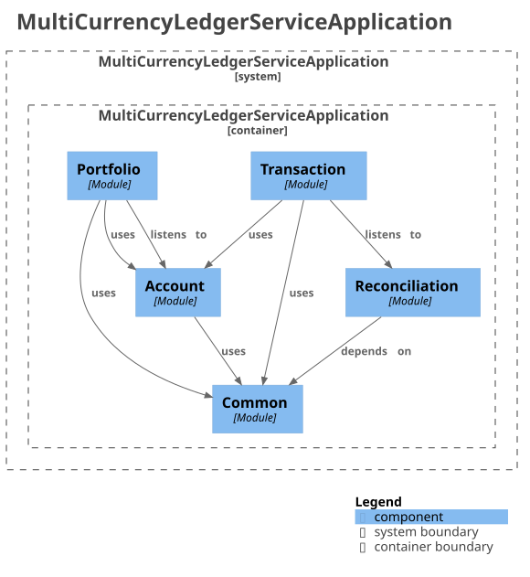
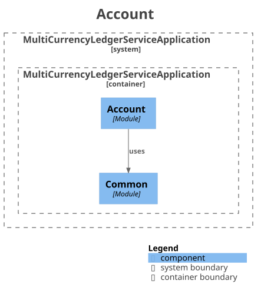
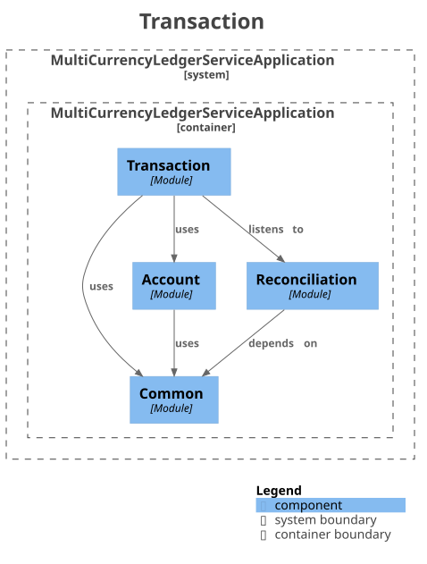
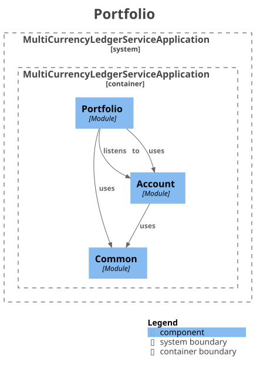
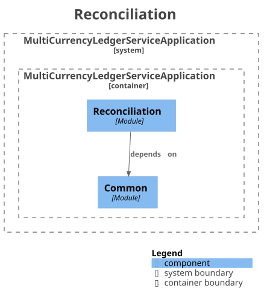

<div align="center">
  <h1>Multi-Asset Ledger System</h1>
  <p><b>엔터프라이즈급 다중 자산 포트폴리오 불변 원장 시스템</b></p>

  <p>
    
    
    
    
  </p>
</div>

> 도메인 주도 설계(DDD)와 복식부기(Double-entry) 모델을 기반으로 구축된 코어 뱅킹 플랫폼입니다.  
> 글로벌 금융 환경에 대응하는 대규모 트래픽 처리와 완벽한 대차평균 정합성을 보장합니다.

---

## Table of Contents
- [Core Architecture](#core-architecture)
- [Evolution Roadmap](#evolution-roadmap)
- [Security Model](#security-model)
- [Market Data](#market-data)
- [System Architecture](#system-architecture)
- [Project Structure](#project-structure)

---

## Core Architecture
금융 시스템의 핵심인 데이터 무결성(Integrity)과 성능(Performance)을 동시에 달성하기 위한 아키텍처 원칙입니다.

* **불변 객체 모델링 (Immutability)** 
  `Money` VO(Value Object)를 도입하여 부동소수점 오차 및 이종 통화 간 연산 오류를 원천 차단합니다.
* **견고한 동시성 제어 (Concurrency Control)** 
  낙관적 락(`@Version`)과 DB 유니크 제약조건, 그리고 비관적 락(`SKIP LOCKED`)을 결합하여 갱신 손실(Lost Update)을 완벽히 방지합니다.
* **최종 정합성 보장 (Eventual Consistency)** 
  Transactional Outbox 패턴과 Kafka 멱등성 프로듀서로 비즈니스 로직과 원장 기록을 분리합니다. 전달 보장 수준은 **at-least-once** 이며, 중복은 컨슈머 측 거래 ID 검사로 흡수합니다. 아웃박스 발행 실패는 지수 백오프(30초~10분)로 최대 10회 재시도한 뒤 데드레터로 격리되며, 격리 건은 `/api/v1/admin/outbox/dead-letters` 관리자 API 로 조회·재발행할 수 있습니다. 원장 기록이 영구 실패한 건은 `ledger_dead_letters` 로 격리하고 지표로 노출해 보상 처리 대상으로 남깁니다.
* **기능 기반 패키징 (Spring Modulith)** 
  Account, Transaction, Portfolio, Reconciliation 등 컨텍스트 단위 분리로 도메인 간 결합도를 최소화합니다.
* **반올림 안전성 (Money Conservation)** 
  고객이 지불하는 금액은 올림, 수취하는 금액은 내림으로 정규화하고 통화 최소 단위 미만의 거래를 거부해, 반올림이 통화를 만들거나 소멸시키지 않도록 보장합니다.
* **대용량 데이터 최적화 (High Throughput)** 
  월차 원장(Monthly Ledger) 기반의 CQRS 아키텍처와 Hibernate Batch Insert(`jdbc.batch_size`)를 통해 대규모 트랜잭션 성능을 최적화합니다. 대사 매칭은 일자별 후보를 메모리에 적재한 뒤 규칙을 순차 평가하는 방식입니다.

---

## Evolution Roadmap
시스템 아키텍처는 총 7단계에 걸쳐 고도화되었으며, 분산 시스템의 안정성과 확장성을 중점으로 진화했습니다.

<details open>
<summary><b>[Phase 1~3] 도메인 모델링 및 성능 최적화</b></summary>
<br>

* **Phase 1: 다중 자산 수용 및 손익 파이프라인**
  * `Money` VO를 적용해 다양한 자산의 소수점 정밀도를 동적으로 처리
  * 미실현 손익과 실현 손익을 분리하여 복식부기에 기록
* **Phase 2: 비동기 이벤트 기반 원장 동기화**
  * Transactional Outbox 패턴을 도입하여 핵심 비즈니스 로직 병목 해소 및 시스템 응답성 향상
* **Phase 3: CQRS 및 월차 원장(Monthly Ledger) 도입**
  * 매월 스냅샷을 생성하는 월차 원장 개념 도입으로, 전체 거래 이력을 재집계하지 않고 최신 월 장부만 조회
    * 최신 월 판별은 `ledger_month` 기준입니다. 시퀀스 `allocationSize` 로 인해 id 순서와 월 순서가 어긋날 수 있어 `MAX(id)` 를 쓰면 지난달 잔고가 조회됩니다

</details>

<details open>
<summary><b>[Phase 4~7] 대규모 분산 아키텍처 및 안정성 고도화</b></summary>
<br>

* **Phase 4: 대규모 트랜잭션 자동 대사(Reconciliation)**
  * PG 정산 데이터를 적재(`SettlementIngestionService`)하고, 월 1회 스케줄러가 대사 배치를 실행
  * 일자별 내부 거래 후보를 메모리에 적재한 뒤 시간·금액·텍스트 유사도 룰을 순차 평가
  * 금액 허용 오차는 통화별로 계산합니다(비율 + 통화 최소 단위 배수). 통화 무시 상수를 쓰면 100 BTC 차이가 일치로 판정됩니다
  * 불일치 건 발생 시 DLQ(Dead Letter Queue)로 격리하여 무중단 배치 파이프라인 완성
* **Phase 5: Kafka 통합 및 최종 정합성 (At-Least-Once + 멱등 소비)**
  * 분산 환경에서 Kafka 멱등성 보장과 PostgreSQL `FOR UPDATE SKIP LOCKED` 큐 폴링을 결합해 메시지 중복/누락 원천 차단
  * `auto-offset-reset: earliest` 로 컨슈머 그룹 최초 연결 이전 메시지의 유실을 방지
  * 컨슈머는 거래 ID 존재 여부로 중복 기록을 흡수합니다. 프로듀서는 트랜잭셔널이 아니므로 `read_committed` 는 현재 실질 효과가 없습니다
* **Phase 6: 외부 연동 시스템 복원력 확보 (Resilience)**
  * Resilience4j 서킷 브레이커를 적용해 통제 범위 밖의 서드파티(PG사, 환율 API) 장애가 내부 시스템으로 전파(Cascading Failure)되는 것을 방지
  * 서드파티 완전 다운 시 캐시된 시세로 성능 저하 대응. 단, 허용 나이를 넘긴 환율은 `ArbitrageRiskException` 으로 거래를 차단합니다(503)
  * `fallbackMethod` 는 가장 바깥 애노테이션에만 둡니다. 내부 `@Retry` 에도 두면 폴백이 예외를 삼켜 서킷 브레이커가 실패를 관측하지 못합니다
* **Phase 7: 풀스택 관측성 파이프라인 (Observability)**
  * Correlation ID를 HTTP 진입점부터 Kafka 이벤트 컨슈머까지 주입하여 ELK 기반 분산 추적(Distributed Tracing) 체계 구축
  * Micrometer를 활용해 보유 현금 총액(Gauge), 폴백 횟수(Counter), 핵심 API 및 배치 응답 시간(Timer/Histogram) 등 비즈니스 커스텀 지표를 Prometheus로 실시간 노출

</details>

---

## Security Model

거래·조회 API 는 인증을 요구하며, 계좌 접근은 **소유권 검증**을 통과해야 합니다.
인증만 붙이고 소유권을 확인하지 않으면 계좌 ID 를 경로에 담아 보내는 것만으로 남의 계좌를 거래할 수 있습니다.

| 경로 | 요구 사항 |
| :--- | :--- |
| `POST /api/v1/accounts/{accountId}/trades/**` | 인증 + `{accountId}` 소유권 (관리자는 예외) |
| `GET /api/v1/portfolios/{accountId}` | 인증 + `{accountId}` 소유권 (관리자는 예외) |
| `/api/v1/admin/**` | `ROLE_ADMIN` |
| `/actuator/health`, `/actuator/info` | 공개 (상세 정보는 `ROLE_ADMIN` 에게만) |
| 그 외 `/actuator/**` | `ROLE_ADMIN` |

**주체 해석 방식.** 이 서비스는 토큰 발급·검증 주체가 아닙니다. 기본 구현체
`HeaderPrincipalResolver` 는 신뢰 경계(API 게이트웨이)가 검증 후 주입한 헤더를 읽습니다.

```text
X-Auth-Subject     : 주체 식별자 (필수)
X-Auth-Account-Id  : 소유 계좌 UUID
X-Auth-Roles       : 쉼표 구분 역할 목록. ADMIN 또는 ROLE_ADMIN 토큰이 정확히 있을 때만 관리자
X-Gateway-Secret   : (선택) ledger.security.gateway-secret 설정 시 필수
```

> **운영 주의**: 위 헤더는 외부에서 직접 도달할 수 없어야 합니다. 게이트웨이가 클라이언트가 보낸
> 동일 헤더를 반드시 제거(strip)하도록 설정하십시오. 네트워크 격리만으로 이를 보장할 수 없다면
> `ledger.security.gateway-secret`(환경변수 `GATEWAY_SHARED_SECRET`)을 설정하십시오 — 설정 시
> 게이트웨이가 `X-Gateway-Secret` 헤더에 같은 값을 실어 보낸 요청만 인증 헤더를 신뢰합니다.
> JWT 를 직접 검증해야 한다면 `PrincipalResolver` 를 구현한 빈 하나만 등록하면 기본 구현체는 물러납니다.

---

## Market Data

시세는 자산군별로 다른 공급자에서 가져옵니다. `ExchangeRateProvider` 포트를 구현하는 것은
`MarketDataRouter` 하나뿐이고, 라우터가 자산 코드를 보고 어댑터를 고릅니다.

| 자산군 | 공급자 | 근거 |
| :--- | :--- | :--- |
| 법정화폐 | [fxratesapi.com](https://fxratesapi.com) | 분 단위 갱신, 임의 base 지정 가능, 키 없이 분당 61건 |
| 암호화폐 | [CoinGecko](https://www.coingecko.com/en/api) | 암호화폐→법정화폐 직접 호가. `ids`·`vs_currencies` 복수 지원으로 포트폴리오 조회를 1회 호출로 묶음 |
| 주식 등 그 외 | 없음 | `UnsupportedAssetCodeException` → 422 `UNSUPPORTED_ASSET` |

* **일 단위 갱신 공급자는 쓸 수 없습니다.** Frankfurter(ECB)와 open.er-api.com 은 갱신이 일 단위라
  탈락했습니다. 이 서비스는 5분을 넘긴 시세에 `ArbitrageRiskException` 을 던져 거래를 차단하므로,
  하루 지난 시세로는 구조가 성립하지 않습니다.
* **작은 환율은 공급자에게 직접 묻지 않습니다.** 무료 시세 API 는 환율을 *절대* 소수 자릿수로
  양자화하므로 1 보다 훨씬 작은 값은 유효숫자가 날아갑니다. 실측: `KRW→BTC` 참값 `9.3461e-9` 을
  `9e-9` 로 반환(오차 3.7%), `places` 파라미터로도 복구되지 않습니다. 그래서 **항상 값이 큰
  방향으로 조회하고 역수는 `BigDecimal` 로 계산**하며, 조회 성공 시 역방향까지 캐시에 심습니다.
  공급자의 역방향 값보다 정밀하고 좁은 쿼터도 절약됩니다.
* **주식은 도메인 모델에만 존재합니다.** `AssetType.STOCK` 으로 원장을 기장할 수는 있지만 무료
  시세 공급자가 없어 거래 시 422 로 거부됩니다. 지원하려면 해당 자산군 어댑터를 추가하고
  라우터 분기에 등록하면 됩니다.
* **PG 정산망 연동은 미구성 상태입니다.** 개인이 접속할 수 없으므로 `ledger.external.pg.base-url`
  기본값이 없습니다. 미설정 시 기동은 되지만 경고가 남고, 정산 데이터가 적재되지 않으므로 대사
  배치는 아무 일도 하지 않습니다.

```bash
# 기본값으로 무료 플랜이 동작합니다. 키를 발급했다면 쿼터 확대를 위해 설정하십시오.
EXCHANGE_RATE_API_URL   # 기본 https://api.fxratesapi.com
EXCHANGE_RATE_API_KEY   # 선택
CRYPTO_PRICE_API_URL    # 기본 https://api.coingecko.com
CRYPTO_PRICE_API_KEY    # 선택 (CoinGecko 데모 키)
PG_API_URL              # 기본값 없음
```

> 지원 암호화폐는 `ledger.external.crypto.symbol-ids` (심볼 → CoinGecko coin id) 로 관리합니다.
> 이 목록이 라우팅 기준도 겸하므로, 새 코인을 추가하려면 여기에 등록하면 됩니다.

---

## System Architecture

<details>
<summary><b>모듈 및 컴포넌트 구성도</b></summary>

#### 1. System Components


#### 2. Bounded Context
| Account (계좌 모듈) | Transaction (원장 모듈) |
| :--- | :--- |
|  |  |
| **Portfolio (자산 모듈)** | **Reconciliation (대사 모듈)** |
|  |  |

</details>


---

## Project Structure

<details>
<summary><b>핵심 디렉토리 구조</b></summary>

```text
multi-currency-ledger-service/
├── src/main/java/.../
│   ├── common/                               # [공통] Money VO, 전역 예외 처리, 인프라 Config
│   ├── account/                              # [Write] 월차 원장 기반 매매 트랜잭션 (낙관적 락)
│   ├── portfolio/                            # [Read/CQRS] 포트폴리오 집계 및 비동기 캐시 갱신
│   ├── transaction/                          # [원장] 복식부기 분개, ACL (부패 방지 계층)
│   └── reconciliation/                       # [대사/Batch] 정산 적재, 룰 기반 매칭 엔진, DLQ 처리
├── src/main/resources/db/migration/          # Flyway 마이그레이션 (파티셔닝 스키마, DLQ 등)
└── src/test/java/.../                        # E2E 통합 테스트, Testcontainers 기반 격리 테스트
```

</details>
