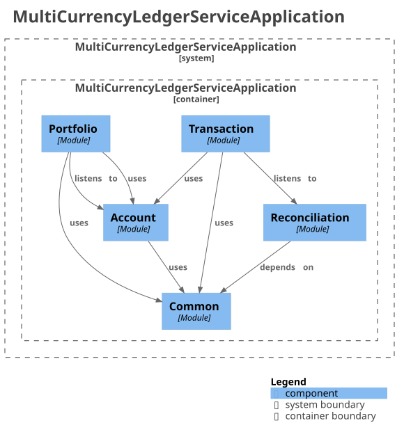
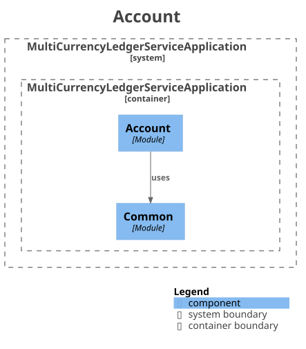
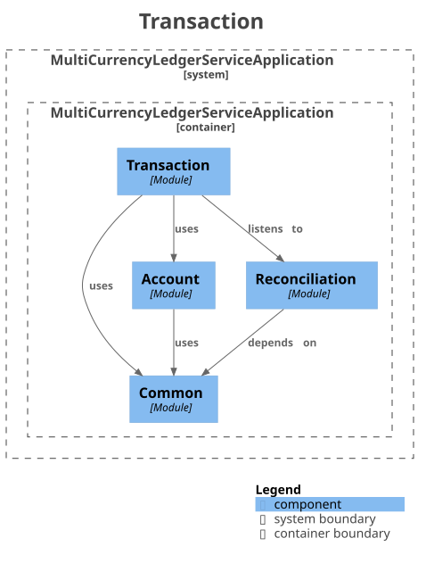
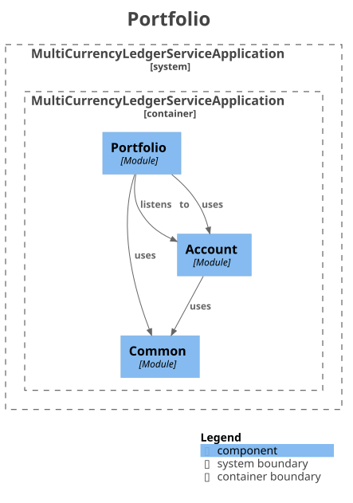
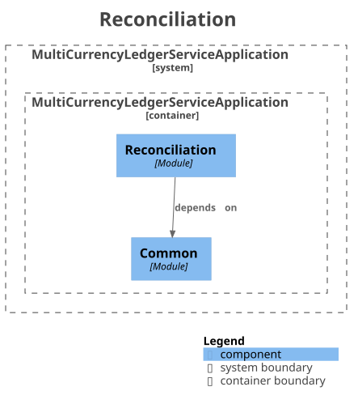

<div align="center">
  <h1>Multi-Currency Ledger Service</h1>
  <p><b>법정화폐·암호화폐를 함께 다루는 복식부기 원장 서비스</b></p>

  <p>
    
    
    
    
    
  </p>
</div>

계좌에서 자산을 사고팔면 **잔고는 즉시 바뀌고, 복식부기 분개는 Kafka를 거쳐 비동기로 기록**됩니다.
외부 시세로 포트폴리오를 평가하고, PG 정산 데이터와 내부 거래를 맞춰 보는 대사 배치를 갖추고 있습니다.

---

## 주요 기능

| 기능 | 내용 |
| :--- | :--- |
| **매수·매도** | 월차 원장의 잔고와 평균 단가 갱신. 멱등성 키로 중복 요청 차단, 시장가 대비 단가 편차 검증 |
| **계좌 개설·입출금·상태 관리** | 관리자·내부 시스템이 계좌를 열고 법정화폐를 입출금. 정지·해제·해지(잔고 0 일 때만)와 변경 이력. 입출금도 멱등성 키를 쓰고 원장에 분개 |
| **복식부기 분개** | 거래 이벤트를 Kafka로 받아 차변·대변 분개 기록. 매도 시 실현 손익 포함, 대차 불일치 시 저장 거부 |
| **포트폴리오 조회** | 보유 자산을 실시간 시세로 평가해 미실현 손익 계산. Redis 캐시, 시세 장애 시 지연 데이터로 표시 |
| **원장 조회** | 계좌별 거래 내역과 거래별 분개(시스템 계정 분개 제외), 기준 통화별 월 시산표(차변 = 대변 + 실현 손익) |
| **원장 정합성 점검** | 매일 고객 잔고(최신 월 원장)와 분개 누계를 계좌·자산별로 비교하고 전체 시산표를 확인. 불일치 건수를 지표로 노출 |
| **정산 대사** | 월 1회 배치로 PG 정산과 내부 거래를 시간·금액·텍스트 규칙으로 매칭. 불일치 건은 DLQ로 격리 |

## 핵심 설계

- **`Money` 값 객체**: `BigDecimal` 기반으로 자산별 소수 자릿수를 적용하고 통화가 다른 금액끼리의 연산을 막습니다. 고객이 내는 금액은 올림, 받는 금액은 내림합니다.
- **동시성 제어**: 원장 갱신은 낙관적 락(`@Version`)과 재시도로, 아웃박스 폴링은 `FOR UPDATE SKIP LOCKED`로 처리합니다.
- **Transactional Outbox**: 잔고 변경과 이벤트 저장을 한 트랜잭션에서 커밋하고, 릴레이가 5초마다 Kafka로 발행합니다.
  - 전달 보장은 **at-least-once**이며, 중복은 컨슈머가 거래 ID로 걸러냅니다.
  - 발행 실패 시 30초~10분 지수 백오프로 최대 10회 재시도한 뒤 데드레터로 격리합니다.
  - 발행이 끝난 이벤트는 발행 후 7일이 지나면 매일 정리합니다. 미처리·데드레터 이벤트는 기간과 관계없이 남깁니다.
- **외부 연동 복원력**: 시세·PG API에 Resilience4j 서킷 브레이커와 재시도를 적용합니다. 시세 공급자가 장애이면 캐시로 대응하되, **5분이 지난 시세로는 거래하지 않습니다**(503).
- **모듈 분리**: Spring Modulith로 `account`, `transaction`, `portfolio`, `reconciliation` 모듈의 경계를 테스트로 검증합니다.
- **원장 정합성 점검**: 잔고는 즉시, 분개는 비동기로 바뀌므로 분개가 DLT나 아웃박스 데드레터로 빠지면 둘이 어긋납니다. 매일 둘을 비교해 `ledger.integrity.mismatches`로 노출합니다.
  - 처리 중인 거래(최근 10분 안에 바뀐 잔고, 발행 대기 중인 아웃박스)는 건너뛰고 다음 회차에 다시 봅니다.
  - 입출금 API 이전에 DB에 직접 넣은 잔고에는 마이그레이션이 기초 잔고(`OPENING_BALANCE`) 분개를 만들었습니다.
- **관측성**: Correlation ID를 HTTP 요청부터 Kafka 컨슈머 로그까지 전달하고, 로그는 JSON(Logstash 인코더)으로 남깁니다. 지표는 Prometheus로 노출합니다(외부 API 응답 시간, 폴백·데드레터 건수, 통화별 보유 총액 등).

---

## 빠른 시작

```bash
# 1. 인프라 실행 (PostgreSQL, Redis, Kafka, Prometheus, Grafana)
docker compose up -d

# 2. 애플리케이션 실행 (local 프로파일은 외부 시세 API 대신 더미 시세 사용)
./gradlew bootRun --args='--spring.profiles.active=local'

# 테스트 (Testcontainers 사용, Docker 필요)
./gradlew test
```

DB 스키마는 기동 시 Flyway가 자동으로 적용합니다.

### 직접 호출해 보기

앱을 띄운 뒤 계좌 개설 → 입금 → 매수 → 조회까지 해 볼 수 있습니다. 로컬에서는 `GATEWAY_SHARED_SECRET`이 비어 있어 `X-Auth-*` 헤더를 그대로 믿으므로, 헤더만으로 관리자나 계좌 소유자가 됩니다.

```bash
ACC=11111111-1111-1111-1111-111111111111

# 1) 계좌 개설과 입금 (관리자)
curl -X POST localhost:8080/api/v1/admin/accounts \
  -H 'X-Auth-Subject: admin' -H 'X-Auth-Roles: ADMIN' -H 'Content-Type: application/json' \
  -d "{\"accountId\":\"$ACC\",\"ownerName\":\"demo\",\"baseCurrency\":\"KRW\"}"
curl -X POST localhost:8080/api/v1/admin/accounts/$ACC/deposits \
  -H 'X-Auth-Subject: admin' -H 'X-Auth-Roles: ADMIN' -H 'Content-Type: application/json' \
  -d '{"idempotencyKey":"dep-1","currency":"KRW","amount":1000000}'

# 2) 매수 (계좌 소유자). local 프로파일의 더미 시세는 1 BTC = 100,000,000 KRW 다.
curl -X POST localhost:8080/api/v1/accounts/$ACC/trades/buy \
  -H 'X-Auth-Subject: demo' -H "X-Auth-Account-Id: $ACC" -H 'Content-Type: application/json' \
  -d '{"idempotencyKey":"buy-1","targetAssetCode":"BTC","targetAssetType":"CRYPTO","paymentCurrency":"KRW","quantity":0.001,"unitPrice":100000000}'

# 3) 포트폴리오와 거래 내역. 분개는 아웃박스와 Kafka 를 거쳐 몇 초 뒤에 기록된다.
curl localhost:8080/api/v1/portfolios/$ACC -H 'X-Auth-Subject: demo' -H "X-Auth-Account-Id: $ACC"
curl localhost:8080/api/v1/accounts/$ACC/transactions -H 'X-Auth-Subject: demo' -H "X-Auth-Account-Id: $ACC"
```

포트폴리오에는 BTC 0.001개와 KRW 900,000원이, 거래 내역에는 `BUY`와 `DEPOSIT`이 나옵니다. 헬스 확인과 지표는 관리 포트에서 봅니다(`curl localhost:9091/actuator/health`).

---

## 배포

```text
PR / main 푸시   ─▶ CI: 전체 테스트 + 이미지 빌드 후 운영 스택으로 기동 확인(스모크 테스트) + 취약점 스캔
PR / main 푸시   ─▶ CI: Prometheus 설정·알림 규칙 단위 테스트(promtool), 대시보드 JSON 검사
main 머지        ─▶ release-please 가 릴리스 PR(다음 버전, CHANGELOG)을 갱신
릴리스 PR 머지   ─▶ 테스트 → 이미지 빌드 → 스모크 테스트 → 취약점 스캔 → GHCR 발행
매주 월요일      ─▶ Dependabot 의존성 업데이트 PR, main 재검증(새로 공개된 취약점 감지)
```

- 버전은 커밋 메시지(Conventional Commits)로 정해집니다. `fix:`는 패치, `feat:`는 마이너 버전을 올립니다.
- 이미지는 `ghcr.io/raonjena99/multi-currency-ledger-service`에 `1.2.3`, `1.2`, `latest`, `sha-xxxxxxx` 태그로 발행됩니다(linux/amd64).
- 취약점 스캔(Trivy)은 수정판이 나온 HIGH/CRITICAL 취약점이 있으면 실패합니다. 악용할 수 없는 항목은 근거와 함께 `.trivyignore`에 적습니다.
- 스모크 테스트를 통과한 이미지만 발행됩니다. 로컬에서도 같은 검사를 돌릴 수 있습니다.
  ```bash
  docker build -t ledger:local . && deploy/smoke-test.sh ledger:local
  ```

서버에서는 `deploy/`의 운영용 스택(앱, PostgreSQL, Redis, Kafka)으로 실행합니다.

```bash
cd deploy
cp .env.example .env        # DB_PASSWORD, GATEWAY_SHARED_SECRET, GRAFANA_ADMIN_PASSWORD 는 필수
docker compose pull && docker compose up -d
```

- 버전을 올릴 때는 `.env`의 `APP_VERSION`을 바꾸고 위 명령을 다시 실행합니다.
- GHCR 패키지가 비공개라면 서버에서 먼저 `docker login ghcr.io`로 로그인해야 합니다.
- 운영용 스택은 애플리케이션 포트만 호스트에 노출하고, 모든 서비스에 재시작 정책(`unless-stopped`)을 둡니다.
- 헬스 확인과 지표 수집(`/actuator/*`)은 관리 포트(`MANAGEMENT_PORT`, 기본 9091)에서만 응답합니다. 이 포트는 호스트에 노출하지 않으므로 같은 네트워크 안에서 접근합니다.

### 모니터링

운영 스택에는 Prometheus와 Grafana가 함께 뜹니다. 둘 다 서버 자신(`127.0.0.1`)에서만 열리므로 SSH 터널로 접속합니다.

```bash
ssh -L 9090:localhost:9090 -L 3000:localhost:3000 <서버>   # Prometheus :9090, Grafana :3000 (admin / GRAFANA_ADMIN_PASSWORD)
```

- Prometheus는 같은 네트워크에서 앱의 관리 포트(`app:9091`)를 수집하고, `deploy/monitoring/alerts.yml`의 규칙을 평가합니다.
- Grafana의 데이터소스와 `Ledger Overview` 대시보드는 `deploy/monitoring/grafana`의 파일로 자동 구성됩니다.
- 알림 전달(Alertmanager → 메일·슬랙)은 아직 설정하지 않았습니다. 지금은 Prometheus의 Alerts 화면과 대시보드에서 확인합니다.

| 알림 | 등급 | 조건 |
| :--- | :--- | :--- |
| `LedgerIntegrityMismatch` | critical | 직전 정합성 점검의 불일치가 0보다 큼 |
| `LedgerDeadLetterUnresolved` | critical | 미해결 원장 데드레터가 2분 넘게 남음 |
| `OutboxDeadLetters` | critical | 아웃박스 데드레터가 2분 넘게 남음 |
| `LedgerServiceDown` | critical | 앱 지표를 2분 넘게 수집하지 못함 |
| `HighServerErrorRate` | warning | 5xx 비율이 5분 넘게 5%를 넘음 |
| `CircuitBreakerOpen` | warning | 외부 API 서킷 브레이커가 5분 넘게 열림 |

규칙을 바꾸면 `deploy/monitoring/alerts.test.yml`도 함께 고칩니다. CI가 `promtool`로 규칙 단위 테스트를 실행합니다.

**서버 없이 로컬에서 확인하기.** 로컬에서 띄우면 `127.0.0.1` 포트에 바로 접속할 수 있어 SSH 터널이 필요 없습니다.

```bash
docker build -t ledger:local .
cd deploy
# up 과 down 모두 compose 파일 전체를 해석하므로 필수 값을 먼저 정해 둔다(값이 없으면 down 도 실패한다).
export APP_IMAGE=ledger:local DB_PASSWORD=local GATEWAY_SHARED_SECRET=local GRAFANA_ADMIN_PASSWORD=local
docker compose -p ledger-local up -d --wait
# Prometheus  http://localhost:9090/alerts
# Grafana     http://localhost:3000/d/ledger-overview  (admin / local)
docker compose -p ledger-local down -v   # 정리
```

PowerShell 에서는 `export` 대신 `$env:DB_PASSWORD="local"` 처럼 변수마다 지정합니다.

---

## API

| 메서드 | 경로 | 권한 |
| :--- | :--- | :--- |
| `POST` | `/api/v1/accounts/{accountId}/trades/buy` | 인증 + 계좌 소유자 |
| `POST` | `/api/v1/accounts/{accountId}/trades/sell` | 인증 + 계좌 소유자 |
| `POST` | `/api/v1/admin/accounts` | `ROLE_ADMIN` |
| `POST` | `/api/v1/admin/accounts/{accountId}/deposits`, `/withdrawals` | `ROLE_ADMIN` |
| `POST` | `/api/v1/admin/accounts/{accountId}/suspend`, `/activate`, `/close` | `ROLE_ADMIN` |
| `GET` | `/api/v1/admin/accounts/{accountId}/status-history` | `ROLE_ADMIN` |
| `GET` | `/api/v1/accounts/{accountId}` | 인증 + 계좌 소유자 |
| `GET` | `/api/v1/portfolios/{accountId}` | 인증 + 계좌 소유자 |
| `GET` | `/api/v1/accounts/{accountId}/transactions`, `/{transactionId}` | 인증 + 계좌 소유자 |
| `GET` | `/api/v1/admin/ledger/trial-balance?month=yyyy-MM` | `ROLE_ADMIN` |
| `POST` | `/api/v1/admin/ledger/integrity-checks` (즉시 실행), `GET` `.../latest` | `ROLE_ADMIN` |
| `GET` | `/api/v1/admin/outbox/dead-letters` | `ROLE_ADMIN` |
| `POST` | `/api/v1/admin/outbox/dead-letters/{eventId}/requeue`, `/requeue-all` | `ROLE_ADMIN` |
| `POST` | `/api/v1/admin/reconciliations/dead-letters/{deadLetterId}/resolve` | `ROLE_ADMIN` |
| `GET` | `/api/v1/admin/ledger/dead-letters` | `ROLE_ADMIN` |
| `POST` | `/api/v1/admin/ledger/dead-letters/{deadLetterId}/replay`, `/resolve` | `ROLE_ADMIN` |
| `GET` | `/actuator/health`, `/info`, `/prometheus` | **관리 포트(기본 9091)에서만** 응답, 인증 없음 |

요청·응답 형식과 에러 코드는 **API 문서**(OpenAPI)에 있습니다. 문서는 앱 포트가 아니라 관리 포트에서만 제공합니다.

- Swagger UI: `http://localhost:9091/actuator/swagger-ui` (Authorize 에서 `X-Auth-*` 헤더를 채워 바로 호출해 볼 수 있습니다)
- OpenAPI JSON: `http://localhost:9091/actuator/openapi`
- 운영에서는 관리 포트가 외부에 노출되지 않으므로 서버 안에서 봅니다.

관리자는 계좌 소유권 검사를 건너뜁니다.

계좌 개설과 입출금은 고객이 직접 호출하지 않습니다. 소유권은 게이트웨이가 `X-Auth-Account-Id`로 정하므로 계좌 ID와 고객의 연결을 관리하는 쪽이 개설해야 하고, 입금은 실제 결제가 확인된 뒤에만 반영해야 하기 때문입니다.

### 인증 방식

이 서비스는 토큰을 직접 검증하지 않고, **API 게이트웨이가 검증 후 넣어 준 헤더**를 신뢰합니다.

```text
X-Auth-Subject     주체 식별자 (필수)
X-Auth-Account-Id  소유 계좌 UUID
X-Auth-Roles       쉼표로 구분한 역할. ADMIN 또는 ROLE_ADMIN 이면 관리자
X-Gateway-Secret   ledger.security.gateway-secret 을 설정한 경우 필수
```

> [!WARNING]
> `GATEWAY_SHARED_SECRET`을 설정하지 않으면 누구나 위 헤더를 직접 보내 다른 사람이나 관리자로 행세할 수 있습니다.
> 외부에 노출하는 환경에서는 반드시 설정하거나, 게이트웨이에서 클라이언트가 보낸 `X-Auth-*` 헤더를 제거하십시오.
> JWT를 직접 검증하려면 `PrincipalResolver`를 구현한 빈을 등록하면 기본 구현체를 대신합니다.

---

## 시세 공급자

`MarketDataRouter`가 자산 코드를 보고 공급자를 고릅니다.

| 자산군 | 공급자 | 비고 |
| :--- | :--- | :--- |
| 법정화폐 | [fxratesapi.com](https://fxratesapi.com) | API 키 없이 사용 가능 |
| 암호화폐 | [CoinGecko](https://www.coingecko.com/en/api) | 여러 코인을 한 번의 호출로 조회 |
| 주식 등 그 외 | 없음 | `422 UNSUPPORTED_ASSET`로 거부 |

- 1보다 훨씬 작은 환율(예: `KRW→BTC`)은 무료 API가 유효숫자를 잘라 버립니다. 그래서 항상 값이 큰 방향으로 조회하고 역수를 직접 계산합니다.
- 지원 암호화폐는 `ledger.external.crypto.symbol-ids`(심볼 → CoinGecko ID)에 등록합니다.

| 환경 변수 | 기본값 |
| :--- | :--- |
| `EXCHANGE_RATE_API_URL` / `EXCHANGE_RATE_API_KEY` | `https://api.fxratesapi.com` / 없음(선택) |
| `CRYPTO_PRICE_API_URL` / `CRYPTO_PRICE_API_KEY` | `https://api.coingecko.com` / 없음(선택) |
| `PG_API_URL` | 없음 |
| `GATEWAY_SHARED_SECRET` | 없음 |

> [!NOTE]
> **PG 정산 연동은 실제로 동작하지 않습니다.** 개인이 접속할 수 있는 PG 정산 API가 없어 `PG_API_URL` 기본값이 없고,
> 정산 적재 서비스(`SettlementIngestionService`)를 호출하는 스케줄러나 API도 아직 없습니다. 따라서 대사 배치는 실행돼도 처리할 데이터가 없습니다.

---

## 아키텍처

<details>
<summary><b>모듈 및 컴포넌트 구성도</b></summary>

#### System Components


#### Bounded Context
| Account (계좌) | Transaction (원장) |
| :--- | :--- |
|  |  |
| **Portfolio (자산)** | **Reconciliation (대사)** |
|  |  |

</details>

```text
src/main/java/.../
├── account/          # 매수·매도, 월차 원장, 멱등성
├── transaction/      # 복식부기 분개, Kafka 컨슈머, 원장 DLT
├── portfolio/        # 포트폴리오 평가, Redis 캐시
├── reconciliation/   # 정산 적재, 대사 배치(Spring Batch), 매칭 규칙
└── common/           # Money, 시세 어댑터, 아웃박스, 보안, 설정
src/main/resources/db/migration/   # Flyway 마이그레이션
deploy/                            # 운영용 docker compose, 이미지 스모크 테스트
```

코드를 처음 읽는다면 [코드 읽기 가이드](docs/CODE_READING_GUIDE.md)부터 보십시오.
